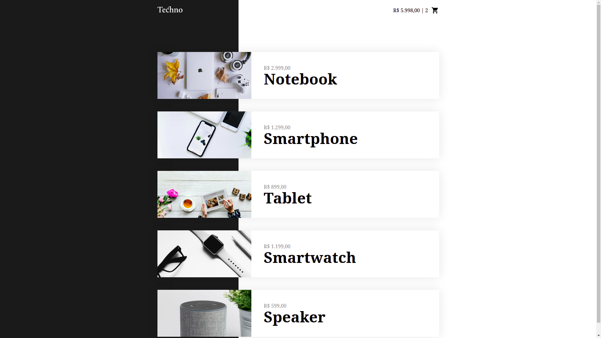
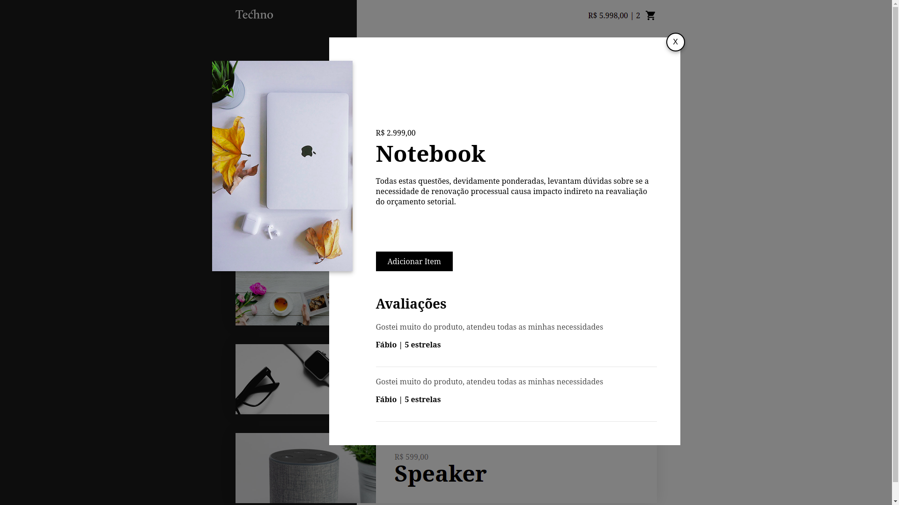

<div align="center" id="top"> 

  &#xa0;

  <!-- <a href="https://fantasticanimals.netlify.com">Demo</a> -->
</div>

<h1 align="center">Techno</h1>

<p align="center">
  

  

  

  <!--  -->

  <!--  -->

  <!--  -->

  <!--  -->
</p>

<!-- Status -->

<!-- <h4 align="center"> 
	🚧  Techno 🚀 Em construção...  🚧
</h4> 

<hr> -->

<p align="center">
  <a href="#dart-sobre">Sobre</a> &#xa0; | &#xa0; 
  <!-- <a href="#sparkles-funcionalidades">Funcionalidades</a> &#xa0; | &#xa0; -->
  <a href="#rocket-tecnologias">Tecnologias</a> &#xa0; | &#xa0;
  <a href="#white_check_mark-pré-requesitos">Pré requisitos</a> &#xa0; | &#xa0;
  <a href="#checkered_flag-começando">Começando</a> &#xa0; | &#xa0;
  <!-- <a href="#memo-licença">Licença</a> &#xa0; | &#xa0; -->
  <a href="https://github.com/henriquelopeslima" target="_blank">Autor</a>
</p>

<br>

## :dart: Sobre ##

O projeto é em sua simplicidade uma aprensentação de uma loja online, com produtos predefinidos em um arquivo JSON, sendo eles consumidos para apresentar na interface, e o carrinho é armazenado no localStorage do navegador. Foi usando e importado o arquivo que contém o vue sem utilizar a CLI.

Esse projeto foi feito com apoio do Curso de Vue.js 2 Completo da <a href="https://www.origamid.com/" target="_blank">Origamid</a>, focado no aprendizado dos fundamentos da tecnologia.




<!-- ## :sparkles: Funcionalidades ##

:heavy_check_mark: Funcionalidade 1;\
:heavy_check_mark: Funcionalidade 2;\
:heavy_check_mark: Funcionalidade 3; -->

## :rocket: Tecnologias ##

As seguintes ferramentas foram usadas na construção do projeto:

- [Git](https://git-scm.com/)
  
## :white_check_mark: Pré requisitos ##

Antes de começar :checkered_flag:, você precisa ter o [Git](https://git-scm.com) instalado em sua máquina.

## :checkered_flag: Começando ##

```bash
# Clone este repositório
$ git clone https://github.com/henriquelopeslima/techno-store

# Entre na pasta
$ cd techno-store

# Basta abrir o index.html no navegador
```

<!-- ## :memo: Licença ##

Este projeto está sob licença MIT. Veja o arquivo [LICENSE](LICENSE.md) para mais detalhes. -->


Feito com :heart: por <a href="https://github.com/henriquelopeslima" target="_blank">Henrique Lopes Lima</a>, utilizando como base o curso da <a href="https://www.origamid.com/" target="_blank">Origamid</a>

&#xa0;

<a href="#top">Voltar para o topo</a>